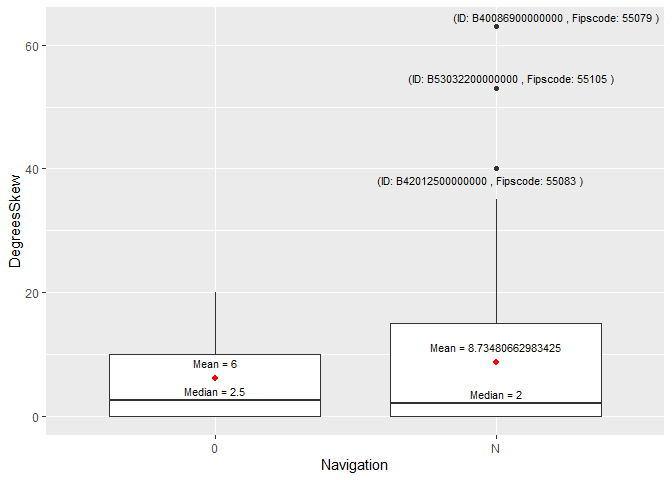

hw1
================

``` r
library(data.table)
library(tidyverse)
library(ggplot2)
library(ggrepel)
```

[https://github.com/hzhang584/bridgeshw/blob/ec057aef5a5bd3d7eae4988285119d8981136e30/README.md](%22https://github.com/hzhang584/bridgeshw/blob/ec057aef5a5bd3d7eae4988285119d8981136e30/README.md%22)

### Downloaded all 14249 observations and 123 variables for Wisconsin in 2019

``` r
d19wi <- fread('https://www.fhwa.dot.gov/bridge/nbi/2019/delimited/WI19.txt')

fipscode <- paste0(d19wi$STATE_CODE_001,str_sub(paste0("00", d19wi$COUNTY_CODE_003), -3, -1)) # construct a 5-digit fipscode
coln <- cbind(names(d19wi)) # identify index of columns in interest
```

### A new file with selected variables

``` r
newdf <- data.frame(d19wi[,c(2, 27, 31, 96, 106, 117)],fipscode,d19wi[,c(67:69,24:25, 41:42,35)])
colnames(newdf) <- c("BridgeID","YearBLt","YearADT","YearIMP","YearRCT","YearFADT","Fipscode","Deck","Superstructure","Substructure","Maintenance","Owner","History","Navigation","DegreesSkew")
```

There are five variables relevant to year in the data-frame (newdf).
Based on the data description included in
[link](https://www.fhwa.dot.gov/bridge/mtguide.pdf), the meaning of the
five variables are different.  
1. YearBLT: the year the bridge was built.  
2. YearADT: the year represented by the recording of average daily
traffic.  
3. YearIMP: the base year for the total project cost.  
4. YearRCT: the year the bridge was reconstructed.  
5. YearFADT: the projected year of future average daily traffic.

### Interested data

``` r
indf <- filter(newdf, Deck == 9, Superstructure == 9, Substructure == 9)
all(indf$Maintenance==indf$Owner, indf$History==5)
```

    ## [1] TRUE

### Plot

``` r
means <- aggregate(DegreesSkew ~ Navigation, indf, mean)
medians <- aggregate(DegreesSkew ~ Navigation, indf, median)

ggplot(indf,aes(Navigation,DegreesSkew)) +
  geom_boxplot() +
  stat_summary(fun=mean, geom="point", shape=20, size=3, color="red", fill="red") +
  geom_text(data = means, aes(label = paste("Mean =", DegreesSkew), y = DegreesSkew + 2.5), size = 3) +
  geom_text(data = medians, aes(label = paste("Median =", DegreesSkew), y = DegreesSkew + 1.5), size = 3) +
  geom_text_repel(data=subset(indf, DegreesSkew>=40), aes(label=paste("(ID:",BridgeID, ", Fipscode:", Fipscode,")")), size = 3)
```

<!-- -->

### Interpretation

The plot is based on the filtered 2019 Wisconsin bridges data-frame
named indf. The data-frame is constructed based on the selection of 15
out of 123 variables from the 2019 Wisconsin bridges data (stored in
data-frame, newdf) and the restriction of bridge condition rating to 5
(the best quality). The 15 variables contains properties of bridges such
as bridge ID, year, fipscodes, condition ratings, maintenance, owner,
history, navigation and degrees skewed. Restricting the bridge condition
rating also leads to the fact that the maintanence variable and owners
variable for all bridges are the same and the historical significance is
5 (Bridge is not eligible for the National Register of Historic Places)
for all bridges. Then, I decided to look at the leftover variables,
navigation and degrees skewed, and try to find out a relationship
between them.

Appearing on the plot, the navigation variable for bridges contains
categorical data. The meaning of navigation is that whether or not the
bridge need a permit for waterway. The label N in navigation means that
there is no waterway around the bridge that a permit is not applicable.
The label 0 in navigation means that there is a waterway around the
bridge and no permit is required. Moreover, the other variable that
appears on the plot is degrees skewed. The degrees skewed variable
contains quantitative data that shows the number of degrees the bridge
is skewed. In order to show the relationship between the categorical
data, navigation, and the quantitative data, degrees skewed, the boxplot
function from ggplot is used.

Based on the plot, for the best condition bridges in Wisconsin, 2019,
the mean of degrees skewed for bridges not around waterway are larger
than the mean of degrees skewed for bridges around waterway that
required no permit. Additionally, there are few outliers in the plot
labeled with bridge id and fipscode. The outlier that has the largest
degrees skewed is with bridge id: B40086900000000 and fipscode: 55079.
Refering back the bridge id to the original data, the name and location
of the bridge is shown below.

``` r
cat("The name of the bridge is: ", d19wi$FEATURES_DESC_006A[d19wi$STRUCTURE_NUMBER_008 == "B40086900000000"])
```

    ## The name of the bridge is:  'HANK AARON STATE TRAIL'

``` r
cat("The location of the bridge is: ", d19wi$LOCATION_009[d19wi$STRUCTURE_NUMBER_008 == "B40086900000000"])
```

    ## The location of the bridge is:  '0.5 M W JCT STH 100'

Then, the Hank Aaron State Trail in Milwaukee County, Wisconsin, is the
bridge that with the best condition, the same numbers of owners and
maintenance, not national register of historical places, and with the
most skewed degree.
